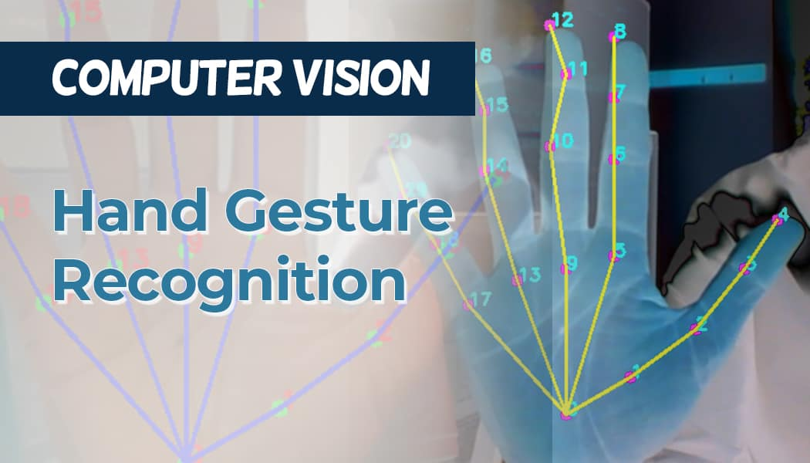

# Hand Gesture Recognition System
## DEPI Final Project
A real-time hand gesture recognition application using Streamlit, OpenCV, and MediaPipe. The system runs entirely in the browser via Streamlit, with live webcam video, gesture prediction, and a modern, responsive UI.



---

## Features
- **Real-time webcam feed** with hand landmark detection (MediaPipe)
- **Gesture prediction** using a trained machine learning model
- **Streamlit UI**: Modern, responsive, and easy to use
- **Dockerized** for easy deployment

---
## Dataset Used For Training
 Dataset is available at: 
 <https://www.kaggle.com/datasetsanoshalhand-gesture-recognition-dataset-one-hand>

 ---
## Getting Started

### 1. Clone the Repository
```sh
git clone <https://github.com/khaled-dotcom/depi-project.git>
cd <your-project-directory>
```

### 2. Install Dependencies (Local, Optional)
```sh
pip install -r requirements.txt
```

### 3. Configure Environment Variables
- Copy `.env.example` to `.env` and fill in any required values (camera index, frame size, etc).

### 4. Run Locally (with Python)
```sh
streamlit run app.py
```
- Open [http://localhost:8501](http://localhost:8501) in your browser.

---

## Running with Docker

### 1. Build the Docker Image
```sh
docker build -t hand-gesture-app .
```

### 2. Run the Docker Container
```sh
docker run -p 8501:8501 --rm hand-gesture-app
```
- Visit [http://localhost:8501](http://localhost:8501)

#### (Optional) Pass Environment Variables
```sh
docker run --env-file .env -p 8501:8501 --rm hand-gesture-app
```

#### (Optional) Webcam Access in Docker
- **Linux only:** Add `--device=/dev/video0` to the run command:
  ```sh
  docker run --device=/dev/video0 -p 8501:8501 --rm hand-gesture-app
  ```
- **Windows/Mac:** Docker Desktop does not natively support webcam passthrough. Run locally for full webcam support.

---

## Project Structure
```
├── app.py                # Streamlit UI (main entry point)
├── src/                  # Source code (config, preprocessing, inference, etc)
├── requirements.txt      # Python dependencies
├── Dockerfile            # For containerized deployment
├── .env.example          # Example environment config                  
└── ...
```

---

## Notes & Tips
- For best results, use in a well-lit environment and show your hand clearly to the camera.
- You can adjust camera settings (resolution, index) in the `.env` file.
- If you want to retrain or swap the gesture model, update the model file and inference logic in `src/inference.py`.
- For production/edge deployment, use Docker on a Linux device for full webcam support.

---

## License
This project is for educational and research purposes. See `LICENSE` for details.
